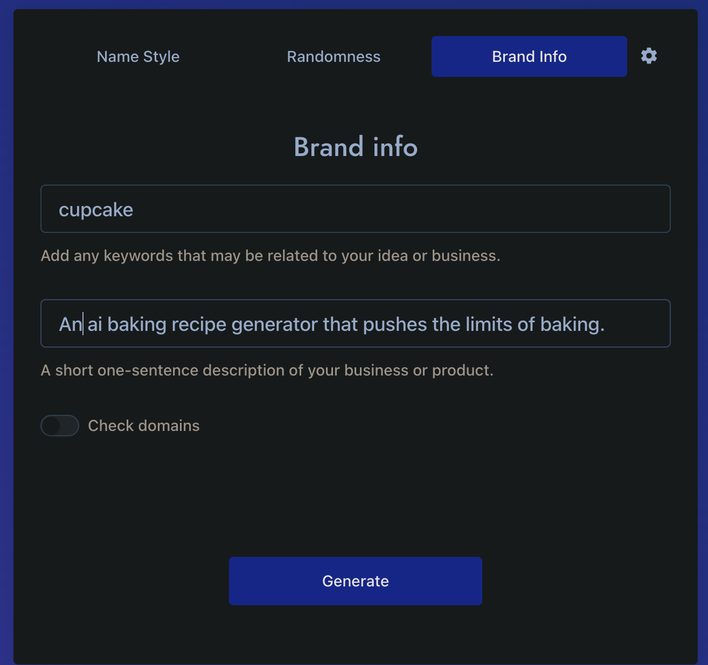

## introduction

Your best friend who is a data engineer has been playing around with a new AI algorithm. You've noticed a big gap in the market for ai baking recipes and decide that you should make your move before someone steals your amazing idea.

Your friend is busy optimizing the cake creator so it's up to you to create a landing page for the project.

It will feature:

- a header with navigation
- a form for user input
- a footer with contact information
- a FAQ page

You also have to create the design and branding for the project.
How on earth will you have time for all this?

Luckily, you are a good developer! Therefore you start searching the web for solutions to your problem. You stumble on a few tools that might help you on your journey.

## Use the AI tools to create your startup persona

If this doesn't interest you, feel free to use the one I generated before:
Born2Bake - has a nice ring to it, it will do!

Here's a list of my favorites, pick one or generate your own on whatever topic you feel inspired by.

- Bakinator
- MagicalMuffins
- BakeBot
- FancyFlour
- BakedAI
- PerfectPastry



[Generate a name for a baking startup](https://namelix.com/app/?keywords=cupcake)
[or pick your own topic](https://namelix.com/)

[Box Model](https://i0.wp.com/css-tricks.com/wp-content/uploads/2021/02/thebox.png?w=570&ssl=1)

See it with your own eyes
Wanna see every single “box” that makes up a page? Try putting this in the stylesheet temporarily:

```css
* {
   outline: 1px solid red !important;
}
```

[Box Model Visualized](https://i0.wp.com/css-tricks.com/wp-content/uploads/2021/02/all-is-a-box.jpg?w=570&ssl=1)

> "You have to let it all go, Neo. Fear, doubt, and disbelief. Free your mind."
> Morpheus, the Matrix

### references

[the best css syntax resource](https://developer.mozilla.org/en-US/docs/Web/CSS/Reference)

[the css box model](https://css-tricks.com/the-css-box-model/)

[box sizing](https://css-tricks.com/almanac/properties/b/box-sizing/)
